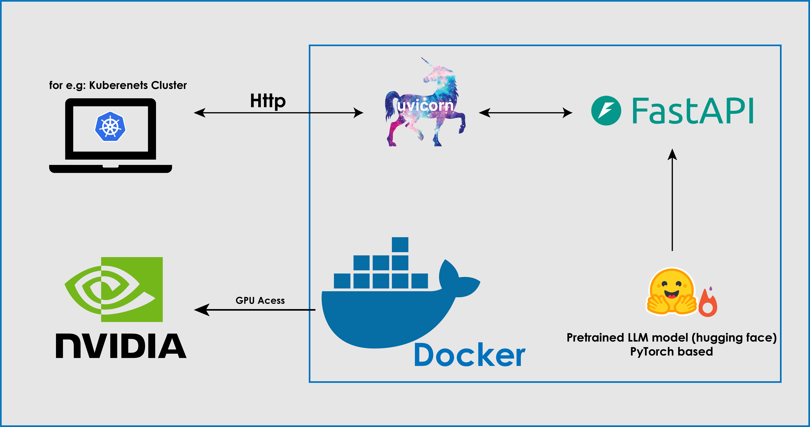

## LLM for text generation deployement using Hugging face's transformers, Pytorch and FastAPI

## Requirements
Install and prepare docker and make sure nvidia runtime is there to use GPU inside docker

## Step 1: 
make sure inside `deploy-nlp-reddit.py` to specify the correct model path after. It can be your local path of bart model in hugging face format (output folder of `Trainer.train()`) or a model name from hugging face hub. 
```code
...

model = BartForConditionalGeneration.from_pretrained('./finetuned-facebook-bart-base/checkpoint-635')
model = model.to(config.DEVICE)
...

```

In case you want to use another LLM model besides the bart model. make sure you do the necessary changes like loading the right tokenizer and imports from transformers library  

Example : 
```code 
from transformers import BartForConditionalGeneration, BartTokenizer

# load bart lighter model 
model_name = 'facebook/bart-base' 
model = BartForConditionalGeneration.from_pretrained(model_name)
tokenizer = BartTokenizer.from_pretrained(model_name)

# for t5-base or use 't5-small' for even more lighter version

model_name = 't5-base'
tokenizer = T5Tokenizer.from_pretrained(model_name) 
model = T5ForConditionalGeneration.from_pretrained(model_name)
model = model.to(config.DEVICE)

```


## Step 2 : Deploy 
```console
sudo docker build -t hf-llm-app . 
sudo docker run --gpus all -d -p 8000:8000 hf-llm-app
```
make sure the container is running 

```console
sudo docker ps 
CONTAINER ID   IMAGE        COMMAND                  CREATED         STATUS         PORTS                                       NAMES
16e302db0dc7   hf-llm-app   "/opt/nvidia/nvidia_…"   5 seconds ago   Up 5 seconds   0.0.0.0:8000->8000/tcp, :::8000->8000/tcp   gallant_shtern

```
## Step 3 : inference using GPU (CUDA) 

Then make a request to this endpoint `http://localhost:8000/generate/`

```console
curl -X POST "http://localhost:8000/generate/" -H "Content-Type: application/json" -d '{"prompt": "this story is about ", "max_length": 200}'

```
Output should look like this : 

```console 
{"generated_text with (cuda)":"a little girl who was in a relationship with one of her friends..... "}
```
#### Note : the `(cuda)` is an indication that if the container is actually using the GPU or not 
# Deployement Illustration 

