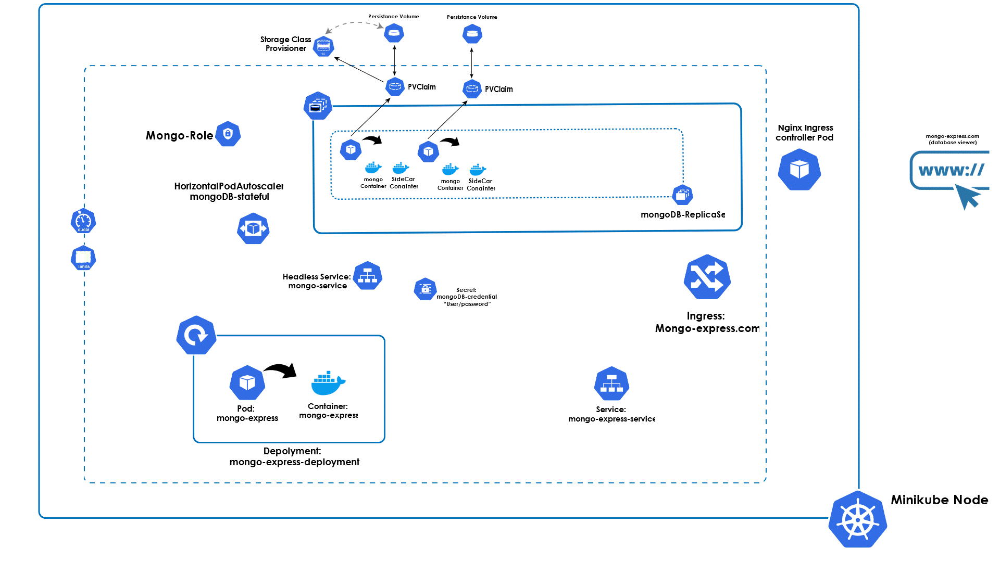

# Kubernetes / MongoDB + Mongo Express

In this repository, you will find a manifest file that generates MongoDB StatefulSet instances. These instances automatically scale using SideCar containers. You can also use Mongo Express through Ingress to visualize and access the database within the MongoDB pods.

## Prerequisites

You need to install Minikube (local cluster) and `kubectl` to manage the cluster for this setup.

## Setup

After installing the Kubernetes tools, you need to apply the manifest files (create the namespace first).

### Start Minikube (your local cluster)

For example:

```bash
minikube start --memory=7900mb --cpus=8
```

#### 1 - MongoDB
Apply the manifest files of mongoDB 
```console
kubectl apply -f mongo-namespace.yml 
kubectl apply -f mongo-sc.yaml 
kubectl apply -f mongo-secret.yml 
kubectl apply -f mongo-prod.yaml 
kubectl apply -f mongo-hpa.yaml 
```
you will have something like this 

```console
$ kubectl get pods -n mongodb
NAME                                          READY   STATUS    RESTARTS   AGE
mongo-prod-deploy-0                           2/2     Running   0          47m
mongo-prod-deploy-1                           2/2     Running   0          46m
mongo-prod-deploy-2                           2/2     Running   0          46m
```
```console
$ kubectl get services -n mongodb
NAME                      TYPE        CLUSTER-IP     EXTERNAL-IP   PORT(S)     AGE
mongo-prod-srv            ClusterIP   None           <none>        27017/TCP   64m
``` 
Note: The MongoDB service must be headless (it doesn’t have a clusterIP to point directly to the primary MongoDB pod).

#### 2 - Log into the Primary mongoDB node 
After creating the MongoDB pods, log into the primary replica set of MongoDB (usually `mongo-prod-deploy-0`) with:

```console
kubectl -n mongodb exec -it mongo-prod-deploy-0 -- mongo
```
Create a database user

```console
rs0:PRIMARY> use admin
rs0:PRIMARY> db.createUser({
  user: "root",
  pwd: "12345",
  roles: [ { role: "root", db: "admin" } ]
})
```
Then you would see somthing like this : 
```console
rs0:PRIMARY> db.getUsers()
[
        {
                "_id" : "admin.root",
                "userId" : UUID("7462d577-a5d1-413a-848a-a97e3a40e2ba"),
                "user" : "root",
                "db" : "admin",
                "roles" : [
                        {
                                "role" : "root",
                                "db" : "admin"
                        }
                ],
                "mechanisms" : [
                        "SCRAM-SHA-1",
                        "SCRAM-SHA-256"
                ]
        }
]
```
Note: If you change the credentials for the database user, ensure you also update the `mongo-secret.yaml` with the new base64-encoded username and password for Mongo Express to access the database.
To generate the base64 values:

```console 
echo -n "root" | base64
# Output: cm9vdA==
echo -n "12345" | base64
# Output: MTIzNDU=
```

### 3 - Mongo-Express 
Apply Ingress and the mongo-express manifest files
```console
kubetctl apply -f mongo-ingress.yaml 
kubetctl apply -f mongo-express.yaml
```

You will see something like this:


```console
$ kubectl get pods -n mongodb
NAME                                          READY   STATUS    RESTARTS   AGE
mongo-prod-deploy-0                           2/2     Running   0          63m
mongo-prod-deploy-1                           2/2     Running   0          62m
mongo-prod-deploy-2                           2/2     Running   0          62m
mongodb-express-deployment-56cf7b689f-xqq58   1/1     Running   0          59m
```
```console
$ kubectl get services -n mongodb
NAME                      TYPE        CLUSTER-IP     EXTERNAL-IP   PORT(S)     AGE
mongo-prod-srv            ClusterIP   None           <none>        27017/TCP   64m
mongodb-express-service   ClusterIP   10.97.121.86   <none>        8081/TCP    60m
```

### 4 - Accessing Mongo Express Service
After everything is done and running there's two ways to access mongo-express service. Make sure you enable ingress addons 
```console 
$ minikube addons enable ingress
```

After Getting your minikube IP adress 
```console 
$ minikube ip
192.xxx.xx.x
``` 
#### 1st method:
 You add the domaine name "mongo-express.com" to your Local DNS with minikube IP adress as a new line (defined in ingress.yaml, you can change it if you want) 
```console 
$ sudo nano /etc/hosts
...
127.0.0.1       localhost
192.xxx.xx.x    mongo-express.com
....
```
and then you open your browser and type mongo-express.com

#### 2nd method:
You install ModHeader extension on you browser and define the header "mongo-express.com" in the extension and type directly your minikube ip address http://192.xxx.xx.x

login using ME_CONFIG_BASICAUTH_USERNAME and ME_CONFIG_BASICAUTH_PASSWORD defined in mongo-express.yaml ("user"/"password")


### 5 - Scaling MongoDB pods 
To test the HorizontalPodAutoscaler. in the mongo-hpa.yaml we defined 3 minimum replicas as 3 and max as 8. try to scale below 3 or more than 8 (like 1, 2, 9, 10...etc) and you will notice you clusters re-creates the pods to match the min and max replicaset param 

```console 
$ kubectl scale statefulset mongo-prod-deploy --replicas=1 -n mongodb
$ kubectl get pods -n mongodb -w
NAME                                          READY   STATUS        RESTARTS   AGE
mongo-prod-deploy-0                           2/2     Running       0          98m
mongo-prod-deploy-1                           2/2     Running       0          26s
mongo-prod-deploy-2                           2/2     Terminating   0          24s
mongodb-express-deployment-5c8ffb5656-2ff4v   1/1     Running       0          17m
mongo-prod-deploy-2                           0/2     Terminating   0          32s
mongo-prod-deploy-2                           0/2     Terminating   0          32s
mongo-prod-deploy-2                           0/2     Terminating   0          32s
mongo-prod-deploy-2                           0/2     Terminating   0          32s
mongo-prod-deploy-1                           2/2     Terminating   0          34s
mongo-prod-deploy-1                           0/2     Terminating   0          45s
mongo-prod-deploy-1                           0/2     Terminating   0          46s
mongo-prod-deploy-1                           0/2     Terminating   0          46s
mongo-prod-deploy-1                           0/2     Pending       0          0s
mongo-prod-deploy-1                           0/2     Pending       0          0s
mongo-prod-deploy-1                           0/2     ContainerCreating   0          0s
mongo-prod-deploy-1                           2/2     Running             0          2s
mongo-prod-deploy-2                           0/2     Pending             0          0s
mongo-prod-deploy-2                           0/2     Pending             0          0s
mongo-prod-deploy-2                           0/2     ContainerCreating   0          0s
mongo-prod-deploy-2                           2/2     Running             0          2s
```
As you can see they got destroyed and then recreated 

```console 
$ kubectl get pods -n mongodb
NAME                                          READY   STATUS    RESTARTS   AGE
mongo-prod-deploy-0                           2/2     Running   0          99m
mongo-prod-deploy-1                           2/2     Running   0          49s
mongo-prod-deploy-2                           2/2     Running   0          47s
mongodb-express-deployment-5c8ffb5656-2ff4v   1/1     Running   0          18m
```


### A cool animation to illustrate the cluster's infrastructure 


